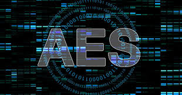
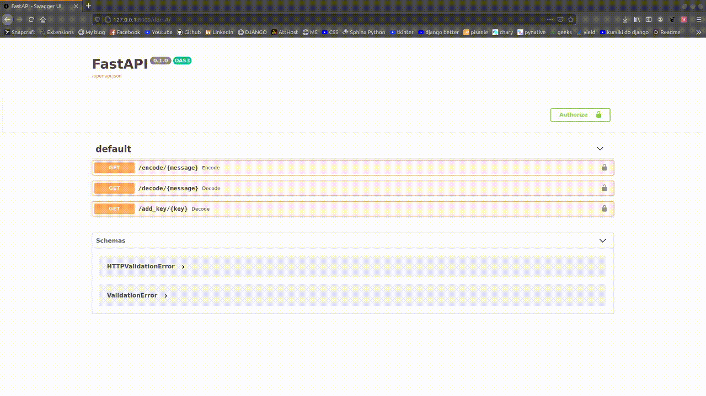
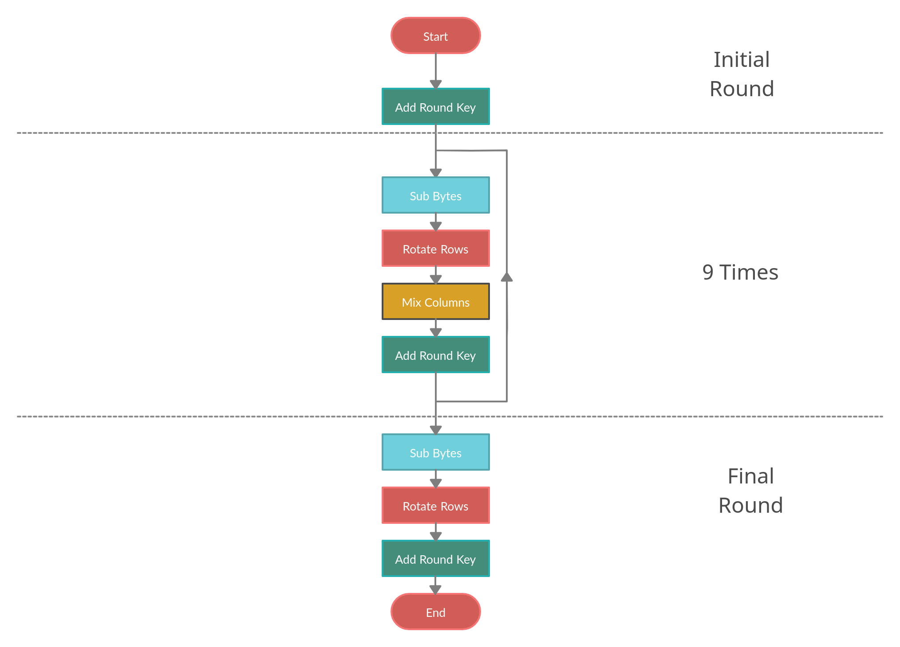
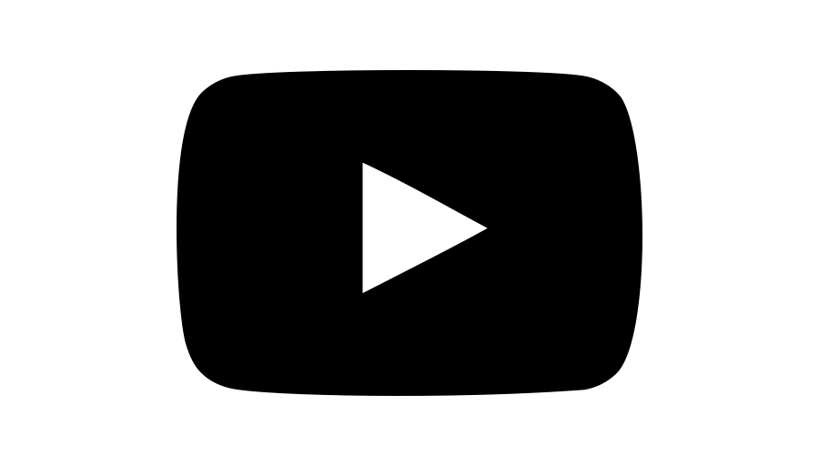
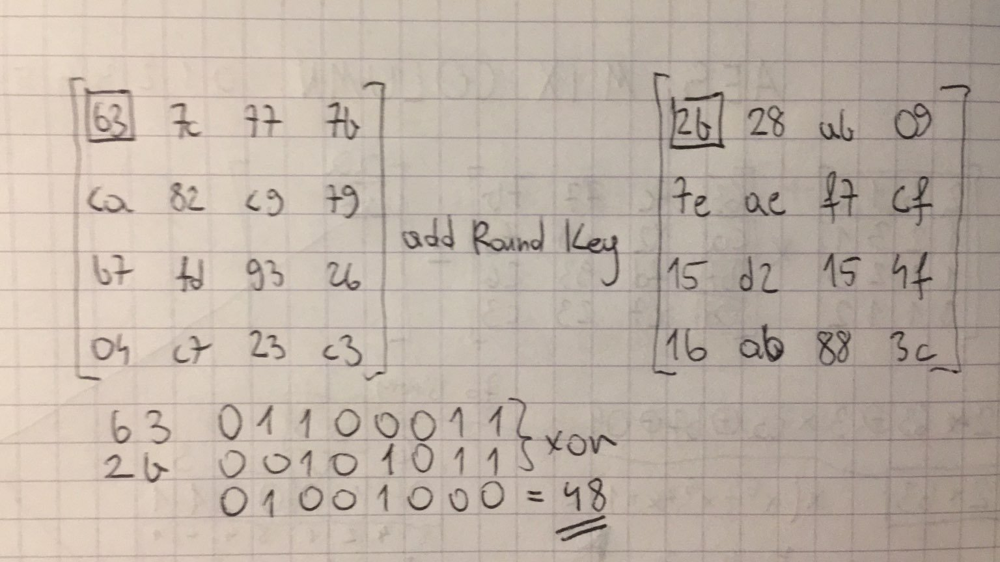
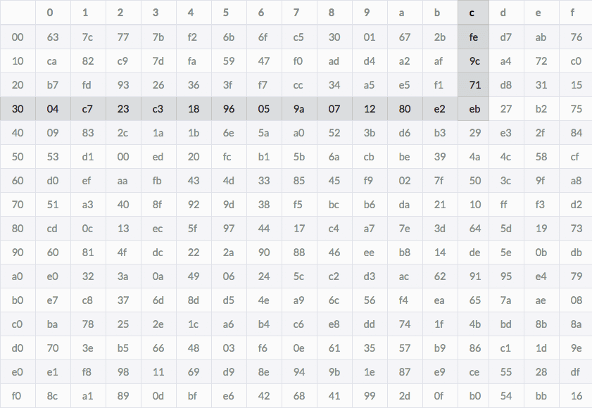
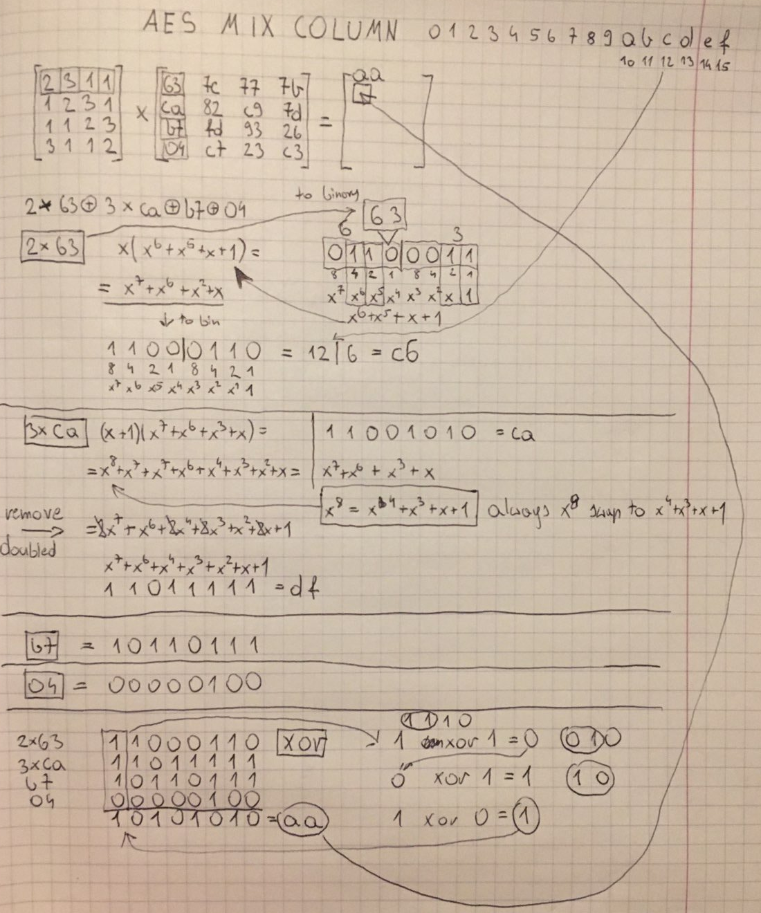
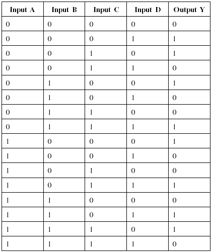

RIJNDAEL CIPHER
=======
# Advanced Encryption Standard

<!-- PROJECT LOGO -->
<p align="center">
    
</p>

## created by Paweł Perenc


<!-- TABLE OF CONTENTS -->
<details open="open">
  <summary>Table of Contents</summary>
  <ol>
    <li>
      <a href="#about-the-project">About The Project</a>
      <ul>
        <li><a href="#definitive-standards">Definitive standards</a></li>
        <li><a href="#built-with">Built With</a></li>
      </ul>
    </li>
    <li>
      <a href="#getting-started">Getting Started</a>
      <ul>
        <li><a href="#installation">Installation</a></li>
         <li><a href="#usage">Usage</a></li>
      </ul>
    </li>
    <li>
      <a href="#how-it-works">How it works</a>
      <ul>
        <li><a href="#ascii-table">ASCII Table</a></li>
        <li><a href="#algorithm-block-diagram">Algorithm block diagram</a></li>
        <li><a href="#sub-bytes">Sub Bytes</a></li>
        <li><a href="#rotate-rows">Rotate Rows</a></li>
        <li><a href="#mix-columns">Mix Columns</a></li>
        <li><a href="#creating-key-schedule">Creating Key Schedule</a></li>
        <li><a href="#add-round-key">Add Round Key</a></li>
      </ul>
    </li>
    <li><a href="#license">License</a></li>
    <li><a href="#more-about-aes-rijndael-cipher">More about AES - Rijndael cipher</a></li>
    <li><a href="#contact">Contact</a></li>
  </ol>
</details>


<!-- ABOUT THE PROJECT -->
## About The Project

The Advanced Encryption Standard (AES), also known by its oryginal name Rijndael developed by two Belgian cryptographers, Vincent Rijmen and Joan Daemen. Their combined last names to name that cipher. It's one of the most popular ciphers in the world, was published in 1997 and adopted as a federal standard in the US in  2002. All dependent data like RCON, SBOX, InvSBOX, KeySchedule is generated by functions inside cipher.py. Before each decoding/encoding user have to provide key, only with proper key message can be decrypted (the same as was used to encrypt)

### Definitive standards

The Advanced Encryption Standard (AES) is defined in each of:
* FIPS PUB 197: Advanced Encryption Standard (AES)
* ISO/IEC 18033-3: Block ciphers

### Built With

* [FastApi](https://fastapi.tiangolo.com/)
* [Python](https://www.python.org/)


<!-- GETTING STARTED -->
## Getting Started

Firstly, you have to install all dependencies

### Installation

1. Clone the repo
  ```sh
  git clone https://github.com/perqu/Rijndael-Cipher.git
  ``` 
2. Install hypercorn
  ```sh
  pip install hypercorn
  ```
  
## Usage
  1. Run Hypercorn - main
  ```sh
  hypercorn main:app --reload
  ```
  2. Run FastAPI
  ```sh
  In your browser: 127.0.0.1:8000/docs
  ```
  3. You can also test Cipher without FastAPI (creating more tests in test.py then run)
  ```sh
  python3 test.py
  ```
  4. Docker:
  Build docker image
  ```sh
  sudo docker build -t myimage .
  ```
  5. Run app in a docker
  ```sh
  sudo docker run -d --network="host" --name mycontainer -p 80:80 myimage
  ```
  6. To connect to docker app:
  ```sh
  In your browser: http://localhost/docs
  ```
  7. FastAPI usage:
<p align="center">
    
</p>
    As you can see on the picture before each operation user have to provide proper key, only one key can decrypt encrypted message. The key must consist 16 characters (all ASCII char are supported without 3rd element)

## How it works
The text to be encrypted must be given in the form of a string, then this string is converted to its representation in the ASCII table 
(it supports all characters except the 3rd element of the ASCII table - end_of_text). The next steps are text encryption, after passing the entire 
encryption scheme, the function returns a string composed of int type elements.
<br>
<br>
This text can be placed in the decoding function that returns the string as it was entered for the first time. 
<br>
<br>
The algorithm before encryption/decryption always breaks down the message into blocks of 16 characters, and then go through the entire scheme for each block

### ASCII TABLE
<p align="center">
    
</p>

### Algorithm block diagram
The algorithm shows all steps in which order they are performed and how many repetition occur
<p align="center">
    
</p>

### Creating Key Schedule
All the steps to create all the roundkeys (Key Schedule) we need are well shown in the video below:
[](https://youtu.be/gP4PqVGudtg?t=175)


### Add Round Key
Adding a key is simply applying the action of xor to all elements of a given block with their corresponding key elements
<br>
Below is an example of such an operation:
<p align="center">
    
</p>

### Sub Bytes
The Sub Bytes operation consists in exchanging data by using the SBOX table, table has inverted version, 
which make possible to decode the message later.
Below is an example of such an operation (for 3c exchanged number would be eb with this SBOX):
<p align="center">
    
</p>

### Rotate Rows
Rotating rows also is very nice presented in the video below:
<br>
[](https://youtu.be/gP4PqVGudtg?t=84)

### Mix Columns
The most complicated operation, the picture below shows an example calculation for one new element placed in the matrix 
<p align="center">
    
</p>
<br>
<br>
4 inputs XOR TABLE - for lazy people ;)
<p align="center">
    
</p>

<!-- LICENSE -->
## License

Distributed under the MIT License.


<!-- More about -->
## More about AES Rijndael cipher
 - https://youtu.be/gP4PqVGudtg
 - https://youtu.be/NHuibtoL_qk
 - https://www.johndcook.com/blog/2019/05/25/aes-s-box/
 - https://en.wikipedia.org/wiki/Rijndael_S-box
 - https://en.wikipedia.org/wiki/Rijndael_MixColumns
 - https://en.wikipedia.org/wiki/AES_key_schedule

<!-- CONTACT -->
## Contact
[![LinkedIn][linkedin-shield]][linkedin-url]

<!-- MARKDOWN LINKS & IMAGES -->
<!-- https://www.markdownguide.org/basic-syntax/#reference-style-links -->
[license-shield]: https://img.shields.io/github/license/othneildrew/Best-README-Template.svg?style=for-the-badge
[license-url]: https://github.com/othneildrew/Best-README-Template/blob/master/LICENSE.txt
[linkedin-shield]: https://img.shields.io/badge/-LinkedIn-black.svg?style=for-the-badge&logo=linkedin&colorB=555
[linkedin-url]: https://www.linkedin.com/in/pawe%C5%82-perenc-51b39315a/
[product-screenshot]: images/screenshot.png
